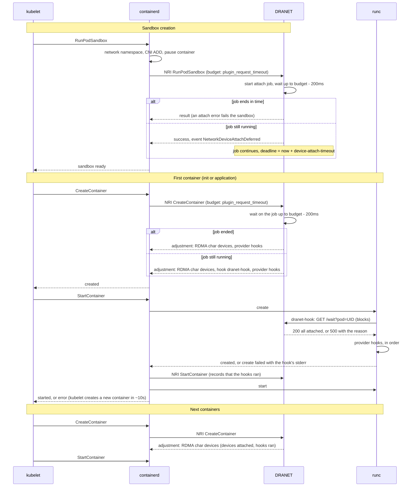

DRANET moves a Pod's network devices into the Pod's network namespace from
the NRI `RunPodSandbox` hook. This page describes where that happens in the
Pod lifecycle, the timeouts that bound it, what DRANET does when the work
does not fit in them, and the OCI hook that keeps a Pod's containers from
starting before all of its devices are attached.

### Timeouts involved

| Setting | Owner | Default | Scope |
|---|---|---|---|
| `plugin_request_timeout` | containerd, `[plugins."io.containerd.nri.v1.nri"]` | `2s` | Every NRI request to DRANET: `RunPodSandbox`, `CreateContainer`, `StartContainer`, `StopPodSandbox`, `RemovePodSandbox`. A reply after the deadline disconnects the plugin and the runtime continues as if the request had succeeded. |
| `--runtime-request-timeout` | kubelet | `2m` | Every CRI call, including the whole `RunPodSandbox` (CNI and all NRI plugins), each `CreateContainer` and each `StartContainer`, which runs the OCI hooks. |
| Pod worker retry | kubelet, not configurable | `10s`, with up to 50% jitter | How soon the kubelet retries a Pod after a container failed to create or to start. |
| `--device-attach-timeout` | DRANET | `30s`, at most `60s` | Time allowed to attach a Pod's devices once `RunPodSandbox` had to return before they were all attached. `0` disables deferring: the sandbox fails instead. |
| Hook `timeout` | DRANET, per container | remaining attach time | The runtime kills the OCI hook and fails the container start when it expires. |
| Provider hook `timeoutSeconds` | profile provider, per hook | `10`, at most `30` | Same mechanism, for the hooks a profile provider adds after DRANET's. |
| Hook chain | DRANET, per container | at most `90s` | Upper bound on the sum of the timeouts of a container's hooks: the longest barrier and one provider hook at its maximum always fit; a container whose chain is longer fails to create. |

Attaching one device takes a few hundred milliseconds on some hardware, so a
Pod that claims several devices does not fit in the default NRI request
timeout. Raising `plugin_request_timeout` on the node attaches every device
at sandbox creation and is the preferred configuration. The rest of this page
describes what DRANET does when the attach does not fit.

### Pod lifecycle

The sandbox is created by one CRI call, and each container by two:
`CreateContainer` builds the container's OCI spec, and `StartContainer` has
the low-level runtime (runc) create the container and then start its
process. runc executes the OCI `createRuntime` hooks of the spec between
those two steps, when the container's namespaces exist and before its
process runs. DRANET takes part through NRI in the sandbox creation and in
both container calls, and through the `createRuntime` hooks it adds to the
spec.



The sandbox is reported ready to the kubelet when `RunPodSandbox` returns.
The kubelet then pulls the images and creates and starts the containers, so
with a deferred attach the image pulls and the remaining device attach run
at the same time.

### Attach job

`RunPodSandbox` starts a job that attaches the Pod's devices one by one. For
each device the job moves the network interface and, in exclusive RDMA mode,
the RDMA link into the Pod's network namespace, applies the configuration,
records the device as attached in the checkpoint, and writes the device
status to the `ResourceClaim`. The hook waits for the job for as long as its
own request budget allows, which is 200ms before the runtime's deadline:

* The job ends within the budget: `RunPodSandbox` returns its result. An
  attach error fails the sandbox; the runtime destroys the network namespace,
  the kernel returns the moved devices to the host, and the kubelet creates a
  new sandbox.
* The job is still running and `--device-attach-timeout` is `0`: the job is
  cancelled and the sandbox fails with the event `NetworkDeviceAttachTimeout`.
  The kubelet recreates the sandbox; the Pod does not run until the devices
  fit in the request.
* The job is still running: `RunPodSandbox` returns success with the event
  `NetworkDeviceAttachDeferred`, and the job continues with a deadline of
  `--device-attach-timeout` from now.

`StopPodSandbox` and `RemovePodSandbox` cancel a running job and wait for it
within their own budget before detaching devices, so the job and the detach
never operate on the namespace at the same time. The job checks for
cancellation between devices; a device operation that outlives the budget
finishes in the background and the kernel returns the device to the host when
the namespace goes away.

A DRANET restart loses the job but not the attached state, which is in the
checkpoint. The next `CreateContainer` starts a new job for the remaining
devices, with a fresh `--device-attach-timeout`. A hook that finds no job
fails its container start; the kubelet recreates the container and its
`CreateContainer` starts the job.

### Container barrier

For each container of the Pod the NRI `CreateContainer` hook checks the Pod's
job:

* All devices attached: the container is created without a hook.
* Job still running and the hook binary is configured: DRANET adds
  `dranet-hook` to the container as an OCI `createRuntime` hook, with the
  Pod's remaining attach time as the hook timeout. When the kubelet starts
  the container, runc runs the hook on the host after it created the
  container's namespaces and before it runs the process; the hook blocks
  until the job ends. On success the process starts; on failure the hook
  exits non-zero with the reason, the container start fails, the message
  appears in the Pod's `Failed` event, and the kubelet creates a new
  container.
* Job still running and no hook binary (`--hook-path=`): the container
  creation fails with the progress (`4/6 attached`) and the kubelet retries
  about ten seconds later. This is the fallback when the hook cannot be
  installed on the node.
* Job failed before the deadline: a new job attaches the remaining devices.
* Deadline passed: the container creation fails with the event
  `NetworkDeviceAttachFailed`. The sandbox stays and the kubelet keeps
  retrying this error; delete the Pod to start over.

No process of the Pod's containers runs before every device the Pod claimed
is attached and configured.

When a profile provider returned a runtime hook for a device of the Pod (see
[Webhook Providers](../contributing/webhook-providers.md#runtime-hook-api-runtimehook-true)),
DRANET runs it once per Pod, before the Pod's first container runs: it adds
the hook, after its own, to the containers it creates until one of them
starts, whether or not the attach was deferred, one hook per distinct path
and arguments. runc executes hooks in list order and stops at the first
failure, so a provider hook runs with every device attached and configured
and never needs the wait endpoint. The runtime calls NRI `StartContainer`
once runc created the container, so when DRANET receives it every hook of
the container exited `0`; DRANET records this in the checkpoint and the
later containers of the Pod, and restarts, are created without the hooks.
A new sandbox runs them again. The hooks execute inside the runtime's
`StartContainer`, which the kubelet bounds with `--runtime-request-timeout`;
the per-hook and chain limits above keep the chain well inside it.

DRANET is scoped to the Pod's network namespace, and so are the provider
hooks: they may change network state in that namespace and nothing else.
They receive the Pod and its devices, not the container, and must not use
the OCI container state the runtime writes on their stdin.

### Pods with several containers

The barrier is a property of the Pod, not of a container: all containers of
a Pod share one network namespace, so all of them wait for the same job.

* The kubelet creates and starts a Pod's containers one at a time, in
  order: init containers first, then application containers. The first
  container carries the hooks and waits in its start; by the time the
  kubelet creates the next ones the job has ended and the provider hooks
  ran, so they are created without hooks and start without delay.
* Init containers, restartable init containers (sidecars), application
  containers, and ephemeral containers (`kubectl debug`) all go through
  `CreateContainer` and `StartContainer` and are gated the same way. A
  container that does not use the devices waits like the others; it shares
  the namespace that is being set up.
* A container restart after a crash creates a new container; the Pod's
  devices are already attached and the provider hooks ran, so no hook is
  injected and the restart is not delayed.
* A Pod with several `ResourceClaims` has one job for all of its devices.
* If the kubelet ever creates two containers of a Pod at the same time, they
  share the job; DRANET holds no lock while waiting, so neither delays the
  other's request.
* A hook that fails leaves the other containers unaffected: the kubelet
  creates a new container in place of the failed one, and DRANET starts a
  new job for the remaining devices if the deadline has not passed.

### Behavior changes

| Situation | Before | Now |
|---|---|---|
| Attach fits in the NRI request | All devices attached in `RunPodSandbox`. | Unchanged. |
| Attach does not fit in the NRI request | The runtime disconnected DRANET at the deadline and started the Pod with the devices attached so far. After five disconnects DRANET exited. | `RunPodSandbox` returns before the deadline; the Pod's containers wait for the job through the OCI hook, or the sandbox fails when `--device-attach-timeout=0`. DRANET stays connected. |
| A device fails to attach in `RunPodSandbox` | The sandbox fails. | Unchanged. |
| A device fails to attach after `RunPodSandbox` returned | Not possible. | The container start fails with the reason (the creation, without the hook binary); a new job attaches the remaining devices until the deadline, then `NetworkDeviceAttachFailed`. |
| Pod events | `NetworkDeviceAttachFailed` on an attach error. | Also `NetworkDeviceAttachDeferred`, `NetworkDeviceAttachTimeout`, and `NetworkDeviceAttachFailed` when the deadline passes. The kubelet's `Failed` event carries the hook's reason. |
| `ResourceClaim` status | Written once per claim when `RunPodSandbox` finished. | Written per device as each is attached, with one field manager per device (`dra.net/<device>`), so progress is visible while the job runs. |
| Container OCI spec | RDMA character devices. | RDMA character devices, plus a `createRuntime` hook on containers created while the job runs, and the profile provider's hooks when it returned one (visible with `crictl inspect` under `hooks.createRuntime`). |
| Node | None. | `dranet-hook` installed under `/opt/dranet/bin` by an init container; the daemon serves `/var/run/dranet/hook.sock`. |
| Flags | None. | `--device-attach-timeout`, `--hook-path`. |
| Metrics | NRI request counts and latency. | Also the attach, barrier and hook metrics listed below. |
| Checkpoint | Device configuration. | Also the `attached` flag per device; older databases load as not attached. |

Pods without DRANET devices are not affected: the hooks return immediately for
a Pod the driver has no configuration for.

### Hook contract

The hook is the runtime-side extension point of DRANET, next to the cloud and
profile providers of the preparation side (see
[Webhook Providers](../contributing/webhook-providers.md)). It follows the
same rule as the providers: DRANET passes the hook everything it decided for
the Pod, so the hook does not look the Pod or its devices up elsewhere while
they are changing. DRANET's own hook, `dranet-hook`, waits for the attach;
the hooks a profile provider returns run after it. All of them receive the
same environment.

The runtime executes DRANET's hook as `<path> wait`, and a provider's hook as
`<path> <args>`, as OCI `createRuntime` hooks, with this environment:

| Variable | Content |
|---|---|
| `DRANET_POD_UID` | UID of the Pod. |
| `DRANET_POD_NAMESPACE`, `DRANET_POD_NAME` | Namespace and name of the Pod. |
| `DRANET_NETNS` | Path of the Pod's network namespace. |
| `DRANET_SOCKET` | Unix socket serving the wait endpoint below. |
| `DRANET_DEVICES` | JSON array with one entry per device of the Pod. |

The environment names the Pod and its devices, never the container: the
hooks are scoped to the network namespace.

Each `DRANET_DEVICES` entry has the device name used in the `ResourceSlice`
and the `ResourceClaim`, the claim (`namespace`, `name`), the identifiers of
the device on the host (`host`: `name`, `mac_address`, `pci_address`, the same
object the providers receive), the interface name inside the Pod
(`interface`), the RDMA link device (`rdmaLinkDev`), the network
configuration DRANET applies inside the Pod (`config`, a `NetworkConfig`),
and the data the profile provider attached to its hook for this device
(`data`, opaque to DRANET):

```json
[{"name": "slow0",
  "claim": {"namespace": "default", "name": "pod-slow-attach-nics-mlrz9"},
  "host": {"name": "slow0", "mac_address": "3a:f7:45:09:67:38"},
  "interface": "slow0",
  "config": {"interface": {"name": "slow0"}},
  "data": {"fabric": "a", "rail": 1}}]
```

The runtime writes the OCI container state on the hook's stdin; a hook must
not use it. The container is not the hook's concern, only the Pod's network
namespace at `DRANET_NETNS`. A hook:

* Exits `0` only after the DRANET daemon reports the Pod's devices attached
  (DRANET's hook), or after its post-configuration is applied (a provider's
  hook, which runs after DRANET's).
* Exits non-zero, with the reason on stderr, in every other case, including
  when the daemon is not reachable. The container must not start without
  its devices.

The daemon serves the wait endpoint on `/var/run/dranet/hook.sock`, in the
host directory the DaemonSet already shares for its database:

```
GET /wait?pod=<UID>
```

The request blocks until the Pod's job ends. The response body is JSON:

```json
{"podUID": "...", "attached": 6, "total": 6}
{"podUID": "...", "attached": 4, "total": 6, "error": "..."}
```

| Status | Meaning |
|---|---|
| `200` | All devices attached. |
| `400` | Malformed request. |
| `500` | The attach failed or gave up; `error` has the reason. Also returned for a Pod the daemon does not know, and when no attach is in progress for the Pod. |

The environment and the wait endpoint are in the dependency-free Go package
`pkg/apis/hook`, so a hook binary stays small; the device model
(`HookDevice`) and `RuntimeHook` are in `pkg/apis`.

The `install` subcommand of `dranet-hook` copies the binary to a host
directory; the DaemonSet runs it in an init container because the image has
no shell. The directory (`/opt/dranet/bin` by default, `hookBinDir` in the
Helm chart) must be writable and on a filesystem that allows executables
(not mounted `noexec`).

### Extending

A profile provider that needs to act on the Pod's network namespace once the
devices are in it, before the Pod's first container runs, returns a runtime
hook from `GetRuntimeHook` at prepare time. DRANET records it with the
device and runs it once per Pod after its own hook, with the provider's
`data` in the device's `DRANET_DEVICES` entry. The provider ships the binary
to the node; DRANET does not install it. The hook may only change network
state in that namespace; it does not interact with the Pod's containers.

`--hook-path` selects DRANET's own hook, `dranet-hook` by default, and is
meant for its install location; the environment and the wait endpoint are
the contract for a replacement.

DRANET registers with NRI index `00`. NRI appends each plugin's hooks in
plugin-index order and the runtime executes OCI hooks in list order, so a
`createRuntime` hook added by another NRI plugin runs after DRANET's hook has
exited `0`: when it runs, the Pod's network namespace holds every device
DRANET is responsible for.

Logic that attaches or configures devices belongs in the daemon, through the
provider interfaces, not in the hook. The providers are called at
`NodePrepareResources`, before the sandbox exists, and the attach job applies
what they returned; a provider hook only adds post-configuration on top of
that result.

### Metrics

The daemon exposes these metrics on its metrics endpoint (`--bind-address`,
`:9177` by default), all prefixed `dranet_driver_`. Each one states what to
do when it moves.

| Metric | Meaning | Action |
|---|---|---|
| `nri_request_timeout_seconds` | The runtime's NRI request timeout, taken from the deadline of the last `RunPodSandbox`. | Attaching all the devices of a Pod has to fit in it. Compare it with `device_attach_duration_seconds` times the devices a Pod claims; raise `plugin_request_timeout` when they are close. |
| `device_attach_duration_seconds{result}` | Time to move one device into the Pod and configure it; `attached` or `failed`. | The sum over a Pod's devices must stay below the request timeout, or `RunPodSandbox` defers. |
| `pod_attach_duration_seconds{result}` | Time an attach job took for a Pod; `attached`, `failed` (device error), `cancelled` (sandbox stopped or `--device-attach-timeout` passed). | Values above the request timeout are Pods whose containers waited at the barrier; raise `plugin_request_timeout`. |
| `sandbox_attach_total{result}` | `RunPodSandbox` outcomes: `attached`, `deferred`, `rejected` (`--device-attach-timeout=0`), `failed`. | `deferred` and `rejected` mean the request timeout is too short for the devices of this node: raise `plugin_request_timeout`. `failed` has a `NetworkDeviceAttachFailed` event with the device error. |
| `attach_jobs_running` | Pods whose devices are being attached right now. | None; shows the attach backlog. |
| `attach_deadline_exceeded_total` | Container creations refused because the Pod's devices were not attached within `--device-attach-timeout`. | The Pod does not start and the kubelet keeps retrying: delete the Pod to start over, read its `NetworkDeviceAttachFailed` event for the device error. |
| `hook_waits_total{result}` | Waits of `dranet-hook`: `released` (container started), `failed` (attach failed, the start failed with the reason), `abandoned` (the runtime killed the hook at its timeout). | `failed` and `abandoned` come with a `NetworkDeviceAttach` event on the Pod; `abandoned` also means `--device-attach-timeout` ran out while a container waited. |
| `hook_wait_duration_seconds` | Time containers spent at the barrier. | Start latency added to Pods; raise `plugin_request_timeout` so the attach completes in `RunPodSandbox`. |
| `container_hooks_total{type}` | `createRuntime` hooks added to containers: `barrier` (`dranet-hook`) and `provider` (a profile provider's hook). Counted per container, so kubelet retries count again. | `barrier` growing means attaches are being deferred. |
| `runtime_hooks_completed_total` | Pods whose provider hooks ran (a container carrying them reached its start). | When it lags behind `container_hooks_total{type="provider"}`, the hooks fail or time out; the Pod's `Failed` events have the hook's stderr. |
| `nri_plugin_requests_total{method,status}`, `nri_plugin_requests_latency_seconds{method,status}` | Every NRI request, including `StartContainer`. | A latency close to `nri_request_timeout_seconds` on any method risks a disconnect. |

### Containerd settings that affect the barrier

* `reject_oci_hook_adjustment` in the NRI default validator refuses hooks
  injected by NRI plugins; with it enabled, containers of a Pod whose
  attach is still running, or whose profile has a provider hook, fail to
  create with a validation error. Leave it disabled or do not defer
  (`--device-attach-timeout=0`) and use profiles without hooks.
* `required_plugins` in the same validator makes the runtime reject a
  container that DRANET did not process, for example while DRANET is
  disconnected. It is the containerd-side guard for the case where the NRI
  connection is lost between `RunPodSandbox` and `CreateContainer`; without
  it such a container is created without the hook.

### Observing a deferred attach

`kubectl describe pod` shows the containers in `ContainerCreating` while the
hook waits, and the events in order: `NetworkDeviceAttachDeferred` with the
devices attached at sandbox creation, `Created`, then `Started` once the job
ends. A failed attach shows a `Failed` event for the container start whose
message contains the hook's reason, for example `network devices not
attached (4/6): error moving network device ... to namespace ...`.

`kubectl get resourceclaim -o yaml` shows `status.devices` growing as devices
are attached. The DRANET log of the node reports `RunPodSandbox returning
with the network device attach in progress`, `Attach job finished`, and the
hook's `Hook waiting for the pod's network devices` and `Hook released`.
